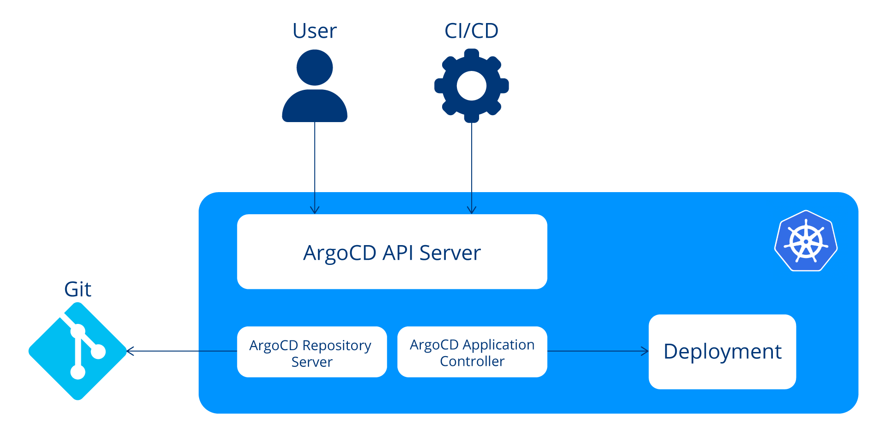
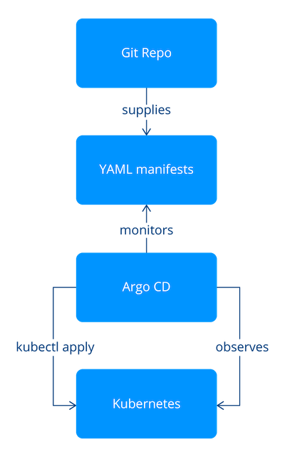
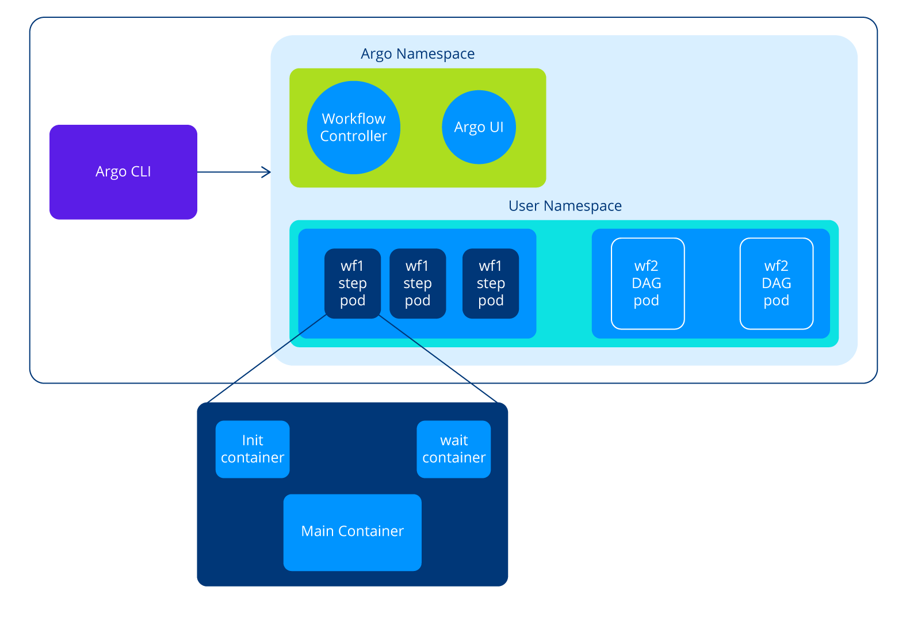
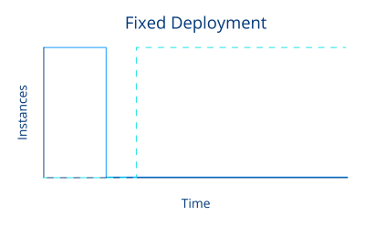
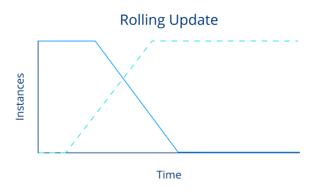
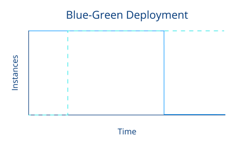
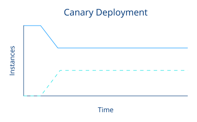
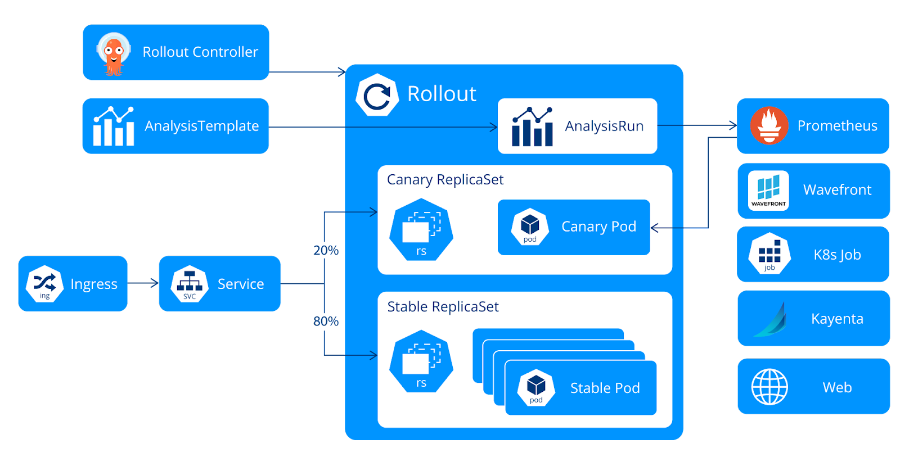
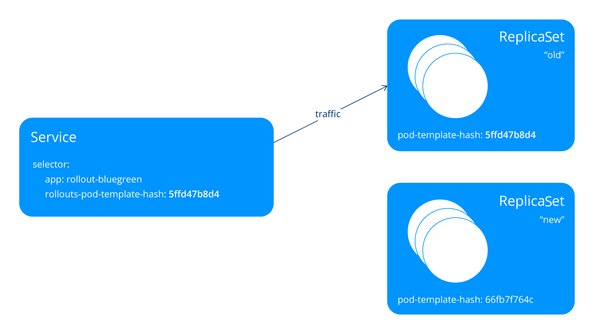
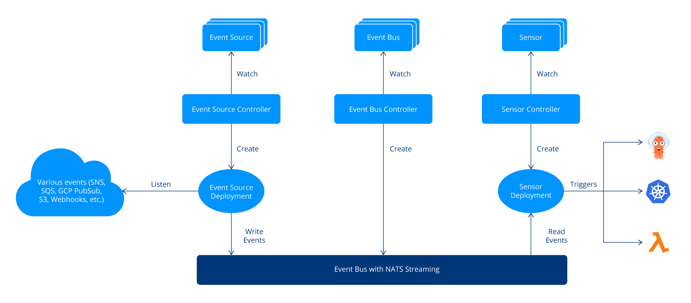

## Table of Contents

- [Certified ARGO Project Associate (CAPA)](#certified-argo-project-associate-capa)
- [Argo Continuous Delivery (ArgoCD)](#argo-continuous-delivery-argocd)
    - [ArgoCD Components](#argocd-components)
        - [API Server](#api-server)
        - [Repository Server](#repository-server)
        - [Application Controller](#application-controller)
    - [Reconciliation Loop](#reconciliation-loop)
    - [Synchronization Principles](#synchronization-principles)
        - [Resource Hooks](#resource-hooks)
        - [Sync waves](#sync-waves)
        - [Resource hooks and sync waves](#resource-hooks-and-sync-waves)
    - [CRDs and Resources](#crds-and-resources)
        - [Application](#application)
        - [AppProject](#appproject)
        - [Repository Credentials](#repository-credentials)
        - [Cluster Credentials](#cluster-credentials)
    - [Argo CD Extensions & Integrations](#argo-cd-extensions--integrations)
        - [Plugins (deprecated, removed in the new versions)](#plugins-deprecated-removed-in-the-new-versions)
        - [Configuring Plugins with ConfigMaps](#configuring-plugins-with-configmaps)
    - [Securing Argo CD](#securing-argo-cd)
    - [Practical Part](#practical-part)
        - [Install Argo CD](#install-argo-cd)
        - [Install ArgoCD cli](#install-argocd-cli)
        - [Add new Users](#add-new-users)
        - [Define the RBAC rules](#define-the-rbac-rules)
        - [Test the new rules](#test-the-new-rules)
- [Argo Workflows](#argo-workflows)
    - [Core Concept](#core-concept)
        - [Template Types](#template-types)
            - [Template Definitions](#template-definitions)
            - [Template Invocators](#template-invocators)
        - [Outputs](#outputs)
        - [WorkflowTemplate](#workflowtemplate)
    - [Architecture](#architecture)
        - [Argo Server](#argo-server)
        - [Workflow Controller](#workflow-controller)
        - [Argo UI](#argo-ui)
        - [Example](#example)
        - [Argo Workflow Overview](#argo-workflow-overview)
    - [Use Case Examples](#use-case-examples)
    - [Practical](#practical)
        - [Install Argo Workflows](#install-argo-workflows)
        - [Install argo cli](#install-argo-cli)
        - [Practical DAG Example](#practical-dag-example)
        - [Practical CI/CD Example](#practical-cicd-example)
- [Argo Rollouts](#argo-rollouts)
    - [Progressive Delivery](#progressive-delivery)
        - [Continuous Integration](#continuous-integration)
        - [Continuous Delivery](#continuous-delivery)
        - [Progressive Delivery](#progressive-delivery-1)
        - [Deployment Strategies](#deployment-strategies)
            - [Recreate/Fixed Deployment](#recreatefixed-deployment)
            - [Rolling Update](#rolling-update)
            - [Blue-Green Deployment](#blue-green-deployment)
            - [Canary Deployment](#canary-deployment)
        - [Strategies for Smooth and Reliable Releases](#strategies-for-smooth-and-reliable-releases)
            - [Benefits of Introducing Deployment Strategies](#benefits-of-introducing-deployment-strategies)
            - [Common Use Cases for Each Strategy](#common-use-cases-for-each-strategy)
    - [Argo Rollouts Architecture and Core Components](#argo-rollouts-architecture-and-core-components)
        - [Argo Rollouts Components](#argo-rollouts-components)
        - [A Refresher: The Kubernetes Replica Set](#a-refresher-the-kubernetes-replica-set)
        - [Argo Rollouts](#argo-rollouts-1)
            - [Argo Rollouts Functionalities](#argo-rollouts-functionalities)
            - [Migrating Existing Deployments to Rollouts](#migrating-existing-deployments-to-rollouts)
            - [Discussion: Create Rollouts or Reference Deployments from Rollouts?](#discussion-create-rollouts-or-reference-deployments-from-rollouts)
        - [Ingress and Service Resources](#ingress-and-service-resources)
            - [Relevant Resources for Traffic Routing](#relevant-resources-for-traffic-routing)
        - [Rollout Analysis](#rollout-analysis)
            - [Analysis Custom Resource Definitions](#analysis-custom-resource-definitions)
        - [Rollout Experiments](#rollout-experiments)
    - [Practical](#practical-1)
        - [Install Argo Rollouts](#install-argo-rollouts)
        - [Install Argo Rollouts CLI](#install-argo-rollouts-cli)
        - [Access Argo Rollouts Dashboard](#access-argo-rollouts-dashboard)
        - [Example commands](#example-commands)
        - [Practical Blue-Green Rollout](#practical-blue-green-rollout)
        - [Practical Migration](#practical-migration)
- [Argo Events](#argo-events)
    - [Event-Driven Architecture](#event-driven-architecture)
        - [Architecture of Argo Events](#architecture-of-argo-events)
    - [Practical](#practical-2)
        - [Installing Argo Workflows](#1-installing-argo-workflows)
        - [Installing Argo Events](#2-installing-argo-events)
        - [Setting Up Event Triggers with Argo](#setting-up-event-triggers-with-argo)
        - [Practical: Integrating Argo Events with External Systems](#practical-integrating-argo-events-with-external-systems)
            - [Triggering a Workflow with Pulsar](#1-triggering-a-workflow-with-pulsar)
            - [Inspecting the Triggered Workflow](#2-inspecting-the-triggered-workflow)

---
# Certified ARGO Project Associate (CAPA)
Argo is a suite of Kubernetes-native tools that streamline workflow automation and application delivery. It includes:

- **Argo CD:** Declarative GitOps continuous delivery.
- **Argo Workflows:** Orchestrates complex jobs and pipelines.
- **Argo Events:** Automates workflows in response to events.
- **Argo Rollouts:** Enables progressive delivery strategies.

---

# Argo Continuous Delivery (ArgoCD)

Argo CD is a declarative GitOps tool for Kubernetes that automates application and infrastructure deployments. It continuously syncs your cluster state with your Git repository, ensuring consistency and traceability. Key features include:

- **Automated Deployments:** Applies manifests from Git to your cluster.
- **Progressive Delivery:** Supports blue-green and canary strategies.
- **Traffic Management:** Integrates with service meshes and ingress controllers.
- **Safe Rollbacks:** Automates promotion and rollback based on deployment analysis.

Argo CD streamlines and secures the delivery of applications to production environments.

## ArgoCD Components


### API Server
The **API Server** in Argo CD acts as the central control plane, providing a unified interface for managing and monitoring your applications. Its core responsibilities include:

- **Application Management:** Manages applications and provides real-time status updates.
- **Operational Control:** Triggers operations (such as sync, rollback, or refresh) on applications as needed.
- **Git Integration:** Handles Git repositories for version control and declarative configuration.
- **Cluster Connectivity:** Manages secure connections with Kubernetes clusters.
- **Authentication & SSO:** Supports authentication mechanisms, including Single Sign-On (SSO).
- **Access Control:** Enforces Role-Based Access Control (RBAC) policies for secure, granular permissions.
- **Central Communication Hub:** Serves as the main point of interaction for the Web UI, CLI, Argo Events, and CI/CD systems.

### Repository Server
The **Repository Server** works closely with the API Server to manage application source code. Its main responsibilities include:

- **Git Retrieval:** Connects to your Git repositories to fetch the latest application manifests and configuration files.
- **Manifest Packaging:** Processes and packages the retrieved files into a format that Kubernetes can understand and apply.
- **Local Caching:** Maintains a secure, up-to-date local cache of repository contents to optimize performance and reduce redundant network calls.
- **Seamless Integration:** Ensures that Argo CD always has access to the desired state of your applications, enabling reliable and efficient deployments.


### Application Controller
The Argo CD Application Controller is another crucial component. It continuously compares the desired application state (as defined in your Git repositories) with the live state in your Kubernetes cluster. If it detects any discrepancies, it will take corrective action to ensure that the live state matches the desired state.

## Reconciliation Loop


The Argo CD reconciliation loop embodies the principles of GitOps by maintaining a Git repository as the single source of truth for infrastructure definitions. This process aligns with the GitOps principles of having a declarative desired state, which is versioned and immutable, and is automatically pulled by software agents. The agents continuously observe the actual system state and attempt to reconcile it with the desired state, mirroring the continuous reconciliation principle of GitOps. Thus, the Argo CD reconciliation loop is a practical implementation of GitOps principles.


## Synchronization Principles

The sync phase is a critical operation in Argo CD, and its behavior can be tailored using **resource hooks** and **sync waves**. This section explains both customization methods and how to use them effectively.

### Resource Hooks

A *sync* is the process of transitioning an application to its desired state. Resource hooks allow you to run custom logic at specific points during this process. There are five hook types:

- **PreSync:** Runs *before* the sync phase (e.g., create a backup before syncing).
- **Sync:** Runs *during* the sync phase, after all PreSync hooks succeed (e.g., implement advanced rollout strategies like blue-green or canary).
- **PostSync:** Runs *after* a successful sync, when all resources are healthy (e.g., perform health or integration checks).
- **Skip:** Instructs Argo CD to skip applying the manifest.
- **SyncFail:** Runs *if* the sync fails (e.g., perform cleanup operations).

Resource hooks are typically implemented as Kubernetes `Job` resources, identified by a special annotation. Argo CD uses this annotation to determine when to execute the job.

**Example: Database Schema Migration Hook**

```yaml
apiVersion: batch/v1
kind: Job
metadata:
  generateName: schema-migrate-
  annotations:
    argocd.argoproj.io/hook: PreSync
```


### Sync waves

Essentially, sync waves are a convenient way to split and order to-be-synced manifests. Waves can range from negative to positive values. If not defined, the default value is wave zero. Using sync waves is achieved in the same way as resource hooks—by using annotations.

```yaml
apiVersion: batch/v1
kind: Job
metadata:
  generateName: schema-migrate-
  annotations:
    argocd.argoproj.io/sync-wave: "5"
```

### Resource hooks and sync waves

Both approaches can be utilized simultaneously. The sync operation in Argo CD initiates with the ordering of resources based on the following criteria:

1. **Resource hook phase annotation**
2. **Sync wave annotation**
3. **Kubernetes kind** (for example, namespaces are prioritized, followed by other Kubernetes resources and then custom resources)
4. **Name**

Afterwards, the next wave number to be applied is identified. This number is always the lowest among any out-of-sync or unhealthy resources. Argo CD then applies this wave.

This process is repeated until all phases and waves are in sync and healthy.

> **Note:** If an application has unhealthy resources in the initial wave, it may prevent the application from ever reaching a healthy state.

For safety reasons, Argo CD adds a **2-second delay** between each sync wave. This can be customized using the `ARGOCD_SYNC_WAVE_DELAY` environment variable.

## CRDs and Resources

### Application

Argo CD introduces the **Application CRD**, serving as a representation of the application instance you intend to deploy in your Kubernetes cluster. Think of it as the blueprint for your application within the specified environment.

**Example:**
```yaml
apiVersion: argoproj.io/v1alpha1
kind: Application
metadata:
    name: guestbook
    namespace: argocd
spec:
    project: default
    source:
        repoURL: 'htt‌ps://github.com/argoproj/argocd-example-apps.git'
        targetRevision: HEAD
        path: guestbook
    destination:
        server: 'htt‌ps://kubernetes.default.svc'
        namespace: guestbook
```


### AppProject

For efficient organization, Argo CD provides the **AppProject CRD**. This allows you to group related applications. An example use case involves segregating applications from utility services, enhancing the clarity of your project structure.

**Example:**

```yaml
apiVersion: argoproj.io/v1alpha1
kind: AppProject
metadata:
    name: production
    namespace: argocd
spec:
    description: Production applications
    sourceRepos:
        - '*'
    destinations:
        - namespace: production
            server: 'htt‌ps://kubernetes.default.svc'
    clusterResourceWhitelist:
        - group: '*'
            kind: '*'
```

### Repository Credentials
In real-world scenarios, accessing private repositories is common. Argo CD facilitates this by using Kubernetes Secrets and ConfigMaps. To grant Argo CD access, create the necessary Secret Kubernetes resources with a specific label: `argocd.argoproj.io/secret-type: repository`.  
**Example:**

```yaml
apiVersion: v1
kind: Secret
metadata:
    name: private-repo-creds
    namespace: argocd
    labels:
        argocd.argoproj.io/secret-type: repository
stringData:
    url: 'htt‌ps://github.com/private/repo.git'
    username: <username>
    password: <password>
```

---

### Cluster Credentials

In cases where Argo CD manages multiple Kubernetes clusters, additional access may be required. For this purpose, Argo CD utilizes a distinct Secret type with the label: `argocd.argoproj.io/secret-type: cluster`. This ensures secure access to external clusters not initially included in Argo CD's managed environments.  
**Example:**

```yaml
apiVersion: v1
kind: Secret
metadata:
  name: external-cluster-creds
  labels:
    argocd.argoproj.io/secret-type: cluster
type: Opaque
stringData:
  name: external-cluster
  server: 'ht‌tps://external-cluster-api.com'
  config: |
    {
      "bearerToken": "<token>",
      "tlsClientConfig": {
        "insecure": false,
        "caData": "<certificate encoded in base64>"
        }
    }
```


## Argo CD Extensions & Integrations
### Plugins (deprecated, removed in the new versions)
Argo CD plugins extend the core functionalities of the system, offering additional features beyond the default capabilities.
Plugins in Argo CD follow a specific lifecycle, including registration, initialization, and execution phases. During startup, Argo CD discovers and loads available plugins, initializing them for use throughout the application lifecycle. Critical events, such as application synchronization or deployment, trigger the associated plugins.

### Configuring Plugins with ConfigMaps
Let's explore the configuration of the Notifications plugin using a ConfigMap:

```yaml
apiVersion: v1
kind: ConfigMap
metadata:
  name: argocd-notifications-cm
data:
  context: |
    region: east
    environmentName: staging

  template.a-slack-template-with-context: |
    message: "Something happened in {{ .context.environmentName }} in the {{ .context.region }} data center!"
```

**In this example:**

- The `context` section provides contextual information such as the region and environment name.
- The `template.a-slack-template-with-context` section defines a Slack notification template using Go templating. It references values from the context section to personalize the message.

This ConfigMap enables users to dynamically adjust notification content based on contextual information, providing flexibility in responding to different deployment scenarios.


## Securing Argo CD

### Use RBAC
**Why:** RBAC controls user permissions, ensuring only authorized access to resources and reducing risk.

**How:** Define roles in the `argocd-rbac-cm` ConfigMap and assign them via RoleBindings. Follow least privilege, audit regularly, and test your setup.

### Manage Secrets Securely
**Why:** Protect sensitive data like API keys and passwords from exposure or misuse.

**How:** Store secrets using Kubernetes Secrets, enable encryption at rest and in transit, and consider integrating with external secret managers.

### Keep Argo CD Updated
**Why:** Updates fix vulnerabilities and improve security.

**How:** Regularly check for new releases, test updates in staging, and apply them using standard Kubernetes deployment methods.

> For more on SSO, audit logging, and network policies, see the [Argo CD Security Documentation](https://argo-cd.readthedocs.io/en/stable/operator-manual/security/).


## Practical Part
### Install Argo CD

```bash
kubectl create namespace argocd
kubectl apply -n argocd -f https://raw.githubusercontent.com/argoproj/argo-cd/stable/manifests/install.yaml
```

To access the Argo CD UI, forward the service port:

```bash
kubectl port-forward svc/argocd-server -n argocd 8080:443
```

Then open [http://localhost:8080](http://localhost:8080) in your browser.

Get the initial admin password:

```bash
kubectl -n argocd get secret argocd-initial-admin-secret -o jsonpath="{.data.password}" | base64 -d
```

### Install ArgoCD cli
```bash
brew install argocd
argocd login localhost:8080
```

### Add new Users

1. **Add a New User:**
    - Edit the `argocd-cm` ConfigMap in the `argocd` namespace.
    - Under the `accounts` section, add your new username (e.g., `newuser: login`).
      ```
      data:
        accounts.newuser: login
        accounts.newuser2: login
      ```
    - Save and apply the updated ConfigMap.

2. **Set or Change the Password:**
    - Use the ArgoCD CLI to set the password:
      ```
      argocd account update-password --account newuser [--new-password 12345678]
      ```
    - You need admin credentials for the initial password setup.

3. **Apply Changes:**
    - If required, restart the ArgoCD server deployment to ensure changes take effect.

4. **Login:**
    - The new user can now log in via the CLI or web UI.

### Define the RBAC rules

Open the ConfigMap for editing RBAC rules with this command:

```bash
kubectl edit cm argocd-rbac-cm -n argocd
```

In here we want to create a new policy:

```yaml
data:
  policy.csv: |
    p,role:synconly,applications,sync,*/*,allow
    g,newuser,role:synconly
  policy.default: role:readonly
```

This policy defines the following:

- **`p,role:synconly,applications,sync,*/*,allow`:**  
    This line specifies a permission rule that allows only the sync action on applications. The role `synconly` is created for this purpose.

- **`g,newuser,role:synconly`:**  
    Associates the `newuser` group with the role `synconly`, granting them permission only to sync applications.

- **`policy.default: role:readonly`:**  
    Specifies the default policy for users who don't fall into any explicitly defined category. In this case, they have read-only access.

In ArgoCD, the RBAC rules can be intricately defined, allowing for granular control over access permissions. For a deeper understanding and detailed information on RBAC configurations, refer to the official documentation.

### Test the new rules

Attempt to login as the `developer` user and evaluate the access permissions. Verify if you can successfully synchronize applications. Additionally, explore whether actions such as deletion or other operations are restricted according to the RBAC rules assigned to the `developer`.


---

# Argo Workflows
Argo Workflows extends Kubernetes with a powerful Workflow CRD, enabling organizations to define, schedule, and manage complex workflows as code. Each workflow step runs as a separate pod, allowing for modular, scalable, and parallel execution—ideal for data processing, automation, and especially machine learning (ML) and data pipelines.

**Key Benefits:**
- **Highly Extensible:** Adaptable to a wide range of use cases, from simple batch jobs to intricate pipelines.
- **Parallelism:** Supports fan-out/fan-in patterns for efficient concurrent task execution and result aggregation.
- **Kubernetes-Native:** Seamlessly integrates with Kubernetes, leveraging its scalability and reliability.

Argo Workflows is a robust solution for orchestrating complex, automated processes in cloud-native environments.


## Core Concept

### Template Types

A template can be containers, scripts, DAGs, or other types depending on the workflow structure and is divided into two groups: **template definitions** and **template invocators**.

#### Template Definitions
**Container**

A Container is the most common template type and represents a step in the workflow that runs a container. It is suitable for executing containerized applications or scripts.

Example:

```yaml
- name: whalesay
  container:
    image: docker/whalesay
    command: [cowsay]
    args: ["hello world"]
```

**Resource**

A Resource represents a template for creating, modifying, or deleting Kubernetes resources. It is useful for performing operations on Kubernetes objects.

Example:

```yaml
- name: k8s-owner-reference
  resource:
    action: create
    manifest: |
      apiVersion: v1
      kind: ConfigMap
      metadata:
        generateName: owned-eg-
      data:
        some: value
```

**Script**

A Script is similar to the container template but allows specifying the script inline without referencing an external container image. It can be used for simple scripts or one-liners.

Example:

```yaml
- name: gen-random-int
    script:
        image: python:alpine3.6
        command: [python]
        source: |
            import random
            i = random.randint(1, 100)
            print(i)
```

**Suspend**

A Suspend is a template that suspends execution, either for a duration or until it is resumed manually. It can be resumed using the CLI, the API endpoint, or the UI.

Example:

```yaml
- name: delay
    suspend:
        duration: "20s"
```


#### Template Invocators

**DAG** 

A DAG allows defining our tasks as a graph of dependencies. It is beneficial for workflows with complex dependencies and conditional execution.

```yaml
- name: diamond
    dag:
        tasks:
        - name: A
            template: echo
        - name: B
            dependencies: [A]
            template: echo
        - name: C
            dependencies: [A]
            template: echo
        - name: D
            dependencies: [B, C]
            template: echo
```

**Steps**

Steps are defining multiple steps within a template as several steps need to be executed sequentially or in parallel.

```yaml
- name: hello-hello-hello
    steps:
    - - name: step1
            template: prepare-data
    - - name: step2a
            template: run-data-first-half
      - name: step2b
            template: run-data-second-half
```


### Outputs

In Argo Workflows, the **outputs** section within a step template allows you to define and capture outputs that can be accessed by subsequent steps or referenced in the workflow definition. Outputs are useful when you want to pass data, values, or artifacts from one step to another.

The Output comprises two key concepts:

- **Defining Outputs:**  
    You define outputs within a step template using the `outputs` section. Each output has a name and a path within the container where the data or artifact is produced.

- **Accessing Outputs:**  
    You can reference the outputs of a step using templating expressions in subsequent steps or the workflow definition.

Let’s consider a simple example where one step generates an output parameter and an output artifact, and another step consumes them:

```yaml
apiVersion: argoproj.io/v1alpha1
kind: Workflow
metadata:
    generateName: artifact-passing-
spec:
    entrypoint: artifact-example
    templates:
    - name: artifact-example
        steps:
        - - name: generate-artifact
                template: whalesay
        - - name: consume-artifact
                template: print-message
                arguments:
                    artifacts:
                    - name: message
                        from: "{{steps.generate-artifact.outputs.artifacts.hello-art}}"

    - name: whalesay
        container:
            image: docker/whalesay:latest
            command: [sh, -c]
            args: ["cowsay hello world | tee /tmp/hello_world.txt"]
        outputs:
            artifacts:
            - name: hello-art
                path: /tmp/hello_world.txt

    - name: print-message
        inputs:
            artifacts:
            - name: message
                path: /tmp/message
        container:
            image: alpine:latest
            command: [sh, -c]
            args: ["cat /tmp/message"]
```

- First, the `whalesay` template creates a file named `/tmp/hello-world.txt` by using the `cowsay` command.
- Next, it outputs this file as an artifact called `hello-art`.
- The `artifact-example` template provides the generated `hello-art` artifact as an output of the `generate-artifact` step.
- Finally, the `print-message` template takes an input artifact called `message` and consumes it by unpacking it in the `/tmp/message` path and using the `cat` command to print it into standard output.


### WorkflowTemplate
In Argo Workflows, a **WorkflowTemplate** is a resource that defines a reusable and shareable workflow template, allowing users to encapsulate workflow logic, parameters, and metadata. This abstraction promotes modularity and reusability, enabling the creation of complex workflows from pre-defined templates.

---

**Example: Simple WorkflowTemplate Definition**

```yaml
apiVersion: argoproj.io/v1alpha1
kind: WorkflowTemplate
metadata:
    name: sample-template
spec:
    templates:
        - name: hello-world
            inputs:
                parameters:
                    - name: msg
                        value: "Hello World!"
            container:
                image: docker/whalesay
                command: [cowsay]
                args: ["{{inputs.parameters.msg}}"]
```

**Explanation:**

- The WorkflowTemplate is named `sample-template`.
- It contains a template called `hello-world`.
- The `hello-world` template takes a parameter `msg` (with a default value of "Hello World!") and generates a file with the specified message.

---

Once defined, this WorkflowTemplate can be referenced and instantiated within multiple workflows.

**Example: Referencing a WorkflowTemplate**

```yaml
apiVersion: argoproj.io/v1alpha1
kind: Workflow
metadata:
    generateName: hello-world-
spec:
    entrypoint: whalesay
    templates:
        - name: whalesay
            steps:
                - - name: hello-world
                        templateRef:
                            name: sample-template
                            template: hello-world
```

This workflow references the WorkflowTemplate named `sample-template`, effectively inheriting the structure and logic defined in the template.

---

Using WorkflowTemplates is beneficial when you want to standardize and reuse specific workflow patterns, making it easier to manage, maintain, and share workflow definitions within your organization. They also help in enforcing consistency and reducing redundancy across multiple workflows.


## Architecture

Argo Workflows is an open source workflow orchestration platform designed for Kubernetes. It enables users to define, run, and manage complex workflows using Kubernetes as the underlying execution environment.

---

### Argo Server

The **Argo Server** is a central component that manages the overall workflow resources, state, and interactions. It exposes a REST API for workflow submission, monitoring, and management. The server maintains the state of workflows and their execution, and interacts with the Kubernetes API server to create and manage resources.

---

### Workflow Controller

The **Argo Workflows Controller** is a critical component within the Argo Workflows system. It is responsible for managing the lifecycle of workflows, interacting with the Kubernetes API server, and ensuring the execution of workflows according to their specifications.

- Continuously watches the Kubernetes API server for changes related to Argo Workflows Custom Resources (CRs).
- The primary CR involved is the **Workflow**, which defines the workflow structure and steps.
- Upon detecting the creation or modification of a Workflow CR, the controller initiates the corresponding workflow execution.
- Manages the complete lifecycle of a workflow: creation, execution, monitoring, and completion.
- Resolves dependencies between steps within a workflow, ensuring steps are executed in the correct order based on dependencies specified in the workflow definition.

---

Both the Workflow Controller and Argo Server run in the `argocd` namespace. You can opt for either cluster or namespaced installations; the generated Workflows and Pods will run in the respective namespace.

---

### Argo UI

The **Argo UI** is a web-based user interface for visually monitoring and managing workflows. It allows users to:

- View workflow status, logs, and artifacts
- Submit new workflows


### Example
The diagram below shows an overview of a Workflow and also details of a namespace with generated pods.


- A user defines a workflow using YAML or JSON files, specifying the sequence of steps, dependencies, inputs, outputs, parameters, and any other relevant configurations.

- The workflow definition file is then submitted to the Kubernetes cluster where Argo Workflows is deployed. This submission can be done via the **Argo CLI**, **Argo UI**, or programmatically through Kubernetes API clients.

- The **Workflow Controller** component of Argo Workflows continuously monitors the Kubernetes cluster for new workflow submissions or updates to existing workflows. When a new workflow is submitted, the Workflow Controller parses the workflow definition to validate its syntax and semantics. If there are any errors or inconsistencies, the Workflow Controller reports them to the user for correction.

- Once the workflow definition is validated, the Workflow Controller creates the necessary Kubernetes resources to represent the workflow, such as **Workflow CRDs** (Custom Resource Definitions) and associated **Pods**, **Services**, **ConfigMaps**, and **Secrets**.

- Finally, the Workflow Controller begins executing the steps defined in the workflow. Each step may involve running containers, executing scripts, or performing other actions specified by the user. Argo Workflows ensures that steps are executed in the correct order based on dependencies defined in the workflow.


### Argo Workflow Overview

Each **Step** and **DAG** in Argo Workflows generates a Pod consisting of three containers:

- **init:**  
    A template that contains an init container performing initialization tasks. In this example, it echoes a message and sleeps for 30 seconds, but you can replace these commands with your actual initialization steps.

- **main:**  
    A template containing the main container that executes the primary process once initialization is complete.

- **wait:**  
    A container responsible for tasks such as cleanup, saving parameters, and handling artifacts.

## Use Case Examples

Argo Workflows is a versatile tool with a wide range of use cases in Kubernetes and containerized environments. Here are some common scenarios where Argo Workflows excels:

- **Data Processing Pipelines:**  
    Orchestrate end-to-end data processing workflows, including extraction, transformation, and loading (ETL) tasks.

- **Machine Learning Automation:**  
    Manage ML pipelines for data preprocessing, model training, evaluation, and deployment.

- **CI/CD Pipelines:**  
    Automate building, testing, and deploying applications in Kubernetes, serving as the backbone for continuous integration and delivery.

- **Batch Processing & Scheduled Tasks:**  
    Run batch jobs and periodic tasks at specified intervals or based on cron schedules—ideal for automating routine operations, report generation, and scheduled jobs.

## Practical
### Install Argo Workflows

```bash
helm repo add argo https://argoproj.github.io/argo-helm
helm repo update
helm upgrade -i argo-workflows argo/argo-workflows -n argo --create-namespace -f argo-workflows/values.yaml
```

To access the Argo Workflows UI, forward the server port:

```bash
kubectl -n argo port-forward deployment/argo-workflows-server 2746:2746
```

Argo Workflows will be available at [http://localhost:2746](http://localhost:2746)

### Install argo cli
```bash
ARGO_OS="darwin"; [ "$(uname -s)" != "Darwin" ] && ARGO_OS="linux"
curl -sLO "https://github.com/argoproj/argo-workflows/releases/download/v3.7.0/argo-$ARGO_OS-amd64.gz"
gunzip "argo-$ARGO_OS-amd64.gz"
chmod +x "argo-$ARGO_OS-amd64"
sudo mv "./argo-$ARGO_OS-amd64" /usr/local/bin/argo

source <(argo completion zsh)

# test
argo version
```

Here is a list of the most common commands to operate with Argo Workflows:

| Command                               | Description                                 |
|---------------------------------------|---------------------------------------------|
| `argo list`                           | List workflows                              |
| `argo get <workflow-name>`            | Display details about a workflow            |
| `argo submit <workflow-file.yaml>`    | Submit a workflow                           |
| `argo watch <workflow-name>`          | Watch workflow progress                     |
| `argo template list`                  | List workflow templates                     |
| `argo logs <workflow-name>`           | Display logs for workflow pod(s)            |


### Practical DAG Example
**1. Install Resources**

To successfully deploy this Workflow, we need to temporarily grant admin permissions to the `argo-workflow` ServiceAccount as follows:

```bash
kubectl create rolebinding default-admin --clusterrole=admin \
    --serviceaccount=argo:argo-workflow -n argo
```

> For a production environment, please follow the [official documentation](https://argoproj.github.io/argo-workflows/).

---

**Next steps:**
1. **Create the WorkflowTemplate shown above:**

     ```bash
     kubectl apply -f argo-workflows/examples/dag-workflow-template.yaml
     ```

2. **Submit the DAG workflow to your Kubernetes cluster:**

     ```bash
     kubectl create -f argo-workflows/examples/dag-workflow.yaml
     ```

> In this workflow:
>
> - **Step A** runs first, since it has no dependencies.
> - After **A** finishes, **steps B and C** run simultaneously/parallel.
> - When **B and C** are completed, **step D** starts.
>
> You can also view the completed steps in **Argo UI**.


**2. Inspect Workflow**

Check whether the WorkflowTemplate and Workflow resources have been created:

```bash
kubectl -n argo get workflowtemplates
kubectl -n argo get workflow
```

You can achieve the same by using the Argo Workflow CLI as follows:

```bash
argo -n argo list
```

Now let’s review the details of the Workflow that we just submitted. The output for the command below will be the same as the information shown when you submitted the Workflow:

```bash
argo -n argo get dag-diamond-gvr2w
argo -n argo logs dag-diamond-gvr2w
```

**3. Clean Up the Resources**

We successfully created an Argo Workflow. To keep our working cluster nice and clean, we are going to clean up the resources we created:

```bash
kubectl -n argo delete workflow dag-diamond-gvr2w
kubectl -n argo delete workflowtemplates.argoproj.io echo-template
```


### Practical CI/CD Example
We can start by creating and managing our workflows as code. We will create a Python application workflow with the following steps:

- **Build:** The build step builds the image with the latest changes, using a Python 3 image for this scenario.
- **Tests:** The test step mounts a volume with test files and runs unit tests with the Python unittest library.
- **Deployment:** The deploy step runs the Python container and prints deploy. Normally, this step would involve pushing the tested code to a container registry, like AWS ECR or Harbor, and then deploying it to the production environment.

This lab provides a basic setup for Argo Workflow CI/CD. Depending on your specific requirements, you may want to enhance the workflow with additional steps, such as testing, linting, or pushing the Docker image to a registry.

**1. Deploy Argo Workflow**

Deploy the workflow by running the following command:

```bash
kubectl -n argo create -f argo-workflows/examples/ci-cd-python-workflow.yaml
```

This will create an Argo Workflow named `python-app` along with its respective templates and steps.

---

**2. Inspect the Workflow**

Retrieve information about the workflow, including its status:

```bash
argo -n argo get python-app-sdfsd
argo -n argo-workflows logs python-app-sdfsd
```


# Argo Rollouts

Argo Rollouts is a Kubernetes-native controller that enables advanced progressive delivery strategies, such as blue-green and canary deployments. It integrates with service meshes and ingress controllers for sophisticated traffic management, automates promotion and rollback based on deployment analysis, and ensures safe, reliable releases to production. Argo Rollouts is ideal for teams seeking to enhance deployment safety and flexibility within a GitOps workflow.


## Progressive Delivery

### Continuous Integration

Continuous Integration is a development practice where developers frequently integrate their code into a shared repository, preferably several times daily. Each integration is then verified by an automated build and automated tests.

#### CI Features

- **Frequent code commits**  
    Encourage developers to often integrate their code into the main branch, reducing integration challenges.

- **Automated tests**  
    Cover frequent code commits. Automatically running tests on the new code to ensure it integrates well with the existing codebase. This does not only include unit tests, but also any other higher-order testing method, such as integration- or end-to-end tests.

- **Immediate problem detection**  
    Allows for quick detection and fixing of integration issues.

- **Reduced integration problems**  
    Help to minimize the problems associated with integrating new code.

The main goal of CI is to provide rapid feedback so that if a defect is introduced into the code base, it is identified and corrected as soon as possible.

Once code is in our main branch, it is not deployed in production or even released. This is where the concept of Continuous Delivery comes into play.


### Continuous Delivery

Continuous Delivery is an extension of CI, ensuring the software can be reliably released anytime. It involves the automation of the entire software release process.

#### CD Features

- **Automated release process:**  
    Every change that passes the automated tests can be released to production through an automated process.

- **Reliable deployments:**  
    Ensure that the software is always in a deployable state.

- **Rapid release cycles:**  
    Facilitate frequent and faster release cycles.

- **Close collaboration between teams:**  
    A close alignment between development, QA, and operations teams is required.

The objective of Continuous Delivery is to establish a process where software deployments become predictable, routine, and can be executed on demand.


### Progressive Delivery

Progressive delivery is often described as an evolution of continuous delivery. It focuses on releasing updates of a product in a controlled and gradual manner, thereby reducing the risk of the release, typically coupling automation and metric analysis to drive the automated promotion or rollback of the update.

**Progressive Delivery Features**

- **Canary releases:**  
    Gradually roll out the change to a small subset of users before rolling it out to the entire user base.

- **Feature flags:**  
    Control who gets to see what feature in the application, allowing for selective and targeted deployment.

- **Experiments & A/B testing:**  
    Test different versions of a feature with different segments of the user base.

- **Phased rollouts:**  
    Slowly roll out features to incrementally larger segments of the user base, monitoring and adjusting based on feedback.

The primary goal of Progressive Delivery is to reduce the risk associated with releasing new features and to enable faster iteration by getting early feedback from users.

### Deployment Strategies

Every software system is different, and deploying complex systems often requires additional steps and checks. This is why various deployment strategies have emerged to manage the process of releasing new software versions in production environments.

These strategies are integral to DevOps practices, especially within CI/CD workflows. The choice of deployment strategy can significantly affect the availability, reliability, and user experience of an application or service.

On the following pages, we will present the four most important deployment strategies and discuss their impact on user experience during deployment:

- **Recreate/Fixed Deployment**
- **Rolling Update**
- **Blue-Green Deployment**
- **Canary Deployment**

#### Recreate/Fixed Deployment
A **Recreate deployment** deletes the old version of the application before bringing up the new version. This ensures that two versions of the application never run at the same time, but there is downtime during the deployment. This strategy is also supported by the Kubernetes Deployment object.



---

#### Rolling Update

A **Rolling Update** slowly replaces the old version with the new version. As the new version comes up, the old version is scaled down to maintain the overall count of the application. This reduces downtime and risk as the new version is gradually deployed. This is the default strategy of the Kubernetes Deployment object.




#### Blue-Green Deployment

A blue-green deployment (sometimes referred to as a red/black) has both the new and old versions of the application deployed at the same time. During this period, only the old version receives production traffic. This setup allows developers to run tests against the new version before switching live traffic to it. Once the new version is ready and tested, traffic is switched (often at the load balancer level) from the old environment to the new one. The main advantage is a quick rollback in case of issues and minimal downtime during deployment.

> **Note:**  
> An important drawback of blue-green deployment is that twice the number of instances are created during the deployment. This can be a significant limitation for some environments.




#### Canary Deployment

A small subset of users are directed to the new version of the application while the majority still use the old version. Based on the feedback and performance of the new version, the deployment is gradually rolled out to more users. This reduces risk by affecting a small user base initially, allows for A/B testing and real-world feedback.




### Strategies for Smooth and Reliable Releases

In summary, deployment strategies are fundamental in modern software development and operations for ensuring smooth, safe, and efficient software releases. They cater to the need for balancing rapid deployment with the stability and reliability of production environments.

#### Benefits of Introducing Deployment Strategies

| **BENEFIT**          | **DESCRIPTION**                                                                                                                                                                                                 |
|-----------------------|-----------------------------------------------------------------------------------------------------------------------------------------------------------------------------------------------------------------|
| Risk mitigation       | They allow for safer deployments by reducing the risk of introducing bugs or performance issues into the production environment. Strategies like canary deployments enable gradual exposure to new changes.     |
| User experience       | Maintaining a consistent and high-quality user experience is essential. Strategies like blue–green deployments minimize downtime and potential disruptions to the user experience.                              |
| Feedback and testing  | They provide a framework for gathering real-world user feedback. Canary deployments, in particular, are valuable for understanding how changes perform in a live environment.                                   |
| Rollback capabilities | In case new versions have critical issues, strategies like blue–green deployments allow for quick rollbacks to the previous stable version.                                                                     |

#### Common Use Cases for Each Strategy

| **STRATEGY**          | **SUPPORTED BY**   | **COMMON USE CASES**                                                                                                                                                                                                                  |
|-----------------------|--------------------|----------------------------------------------------------------------------------------------------------------------------------------------------------------------------------------------------------------------------------------|
| Fixed deployment      | Kubernetes Native  | • The most basic way to deploy a workload is whenever downtime is acceptable.<br>• Often stateful workloads (e.g., Databases) require a “recreation” to avoid data corruption.                                                         |
| Rolling update        | Kubernetes Native  | • Commonly used for stateless, low-maintenance workloads like proxies, RESTful APIs, etc.                                                                                                      |
| Blue-green deployment | Argo Rollouts      | • Use when a) you can afford the extra cost of running twice the resources and b) need a quick and easy rollback option.<br>• B/G can also be helpful for experimentation scenarios.<br>• Can be advantageous to update services that depend on stateful connections, e.g., via WebSockets. |
| Canary deployment     | Argo Rollouts      | • Use it whenever a partial rollout is desirable (experimentation with a subset of users, desire a gradual rollout over hours or days, want to make rollout dependent on certain conditions).<br>• It can be a good alternative if the deployments are too large and the infra cost of running a full blue-green is too high. |

---


## Argo Rollouts Architecture and Core Components



### Argo Rollouts Components

- **Argo Rollouts Controller**  
    An operator that manages Argo Rollout Resources. It reads all the details of a rollout (and other resources) and ensures the desired cluster state.

- **Argo Rollout Resource**  
    A custom Kubernetes resource managed by the Argo Rollouts Controller. It is largely compatible with the native Kubernetes Deployment resource, adding additional fields that manage the stages, thresholds, and techniques of sophisticated deployment strategies, including canary and blue-green deployments.

- **Ingress**  
    The Kubernetes Ingress resource is used to enable traffic management for various traffic providers such as service meshes (e.g., Istio or Linkerd) or Ingress Controllers (e.g., Nginx Ingress Controller).

- **Service**  
    Argo Rollouts utilizes the Kubernetes Service resource to redirect ingress traffic to the respective workload version by adding specific metadata to a Service.

- **ReplicaSet**  
    Standard Kubernetes ReplicaSet resource used by Argo Rollouts to keep track of different versions of an application deployment.

- **AnalysisTemplate and AnalysisRun**  
    Analysis is an optional feature of Argo Rollouts and enables the connection of Rollouts to a monitoring system. This allows automation of promotions and rollbacks. To perform an analysis an AnalysisTemplate defines a metric query and their expected result. If the query matches the expectation, a Rollout will progress or rollback automatically, if it doesn’t. An AnalysisRuns is an instantiation of an AnalysisTemplate (similar to Kubernetes Jobs).

- **Metric Providers**  
    Metric providers can be used to automate promotions or rollbacks of a rollout. Argo Rollouts provides native integration for popular metric providers such as Prometheus and other monitoring systems.

> Please note, that not all of the mentioned components are mandatory to every Argo Rollouts setup. The usage of Analysis resources or metric providers is entirely optional and relevant for more advanced use cases.


## A Refresher: The Kubernetes Replica Set

To grasp the workings of Argo Rollouts in handling workloads, it's essential to understand some basics of Kubernetes. Essentially, Argo Rollouts functions in a manner quite similar to Kubernetes Deployment resources. What is less commonly known is that Deployments provide another layer of abstraction for workload management. The Deployment resource was a relatively later addition to Kubernetes, debuting in version 1.5 as part of the `apps/v1beta1` API and achieving stability in version 1.9 with the `apps/v1` API. Before the introduction of Deployments, workload management was accomplished using ReplicaSets. And under the hood, they are used until today!

A **Kubernetes ReplicaSet** is a resource used to ensure that a specified number of pod replicas are running at any given time. Essentially, it's a way to manage the lifecycle of pods. The main function of a ReplicaSet is to maintain a stable set of pod replicas running at any given time. It does so by scheduling pods as needed to reach the desired number.

If a pod fails, the ReplicaSet will replace it; if there are more pods than needed, it will terminate the extra pods. ReplicaSets are used to achieve redundancy and high availability within Kubernetes applications.

For more sophisticated orchestration like rolling updates, rollbacks or scaling, a ReplicaSet is not enough. Kubernetes introduced a higher-level (and usually better known) concept called **Deployment** resource that manages both the deployment and updating of applications.

A deployment is managed by the Kubernetes deployment controller and is responsible for updating ReplicaSets by providing declarative updates for them.

Let's create a Deployment of nginx proxies to demonstrate the ownership between Deployment and ReplicaSet:

```bash
kubectl create deploy nginx-deployment --image=nginx --replicas=3
```

```
deployment.apps/nginx-deployment created
```

Now make sure it properly scaled up:

```bash
kubectl get deployment
```

```
NAME               READY   UP-TO-DATE   AVAILABLE   AGE
nginx-deployment   3/3     3            3           47s
```

```bash
kubectl get replicaset
```

```
NAME                          DESIRED   CURRENT   READY   AGE
nginx-deployment-66fb7f764c   3         3         3       47s
```

The ReplicaSet `nginx-deployment-66fb7f764c` is managed by `nginx-deployment`. You can tell this by inspecting the ReplicaSet:

```bash
kubectl get replicaset nginx-deployment-66fb7f764c -ojsonpath='{.metadata.ownerReferences}' | jq
```

```json
[
    {
        "apiVersion": "apps/v1",
        "blockOwnerDeletion": true,
        "controller": true,
        "kind": "Deployment",
        "name": "nginx-deployment",
        "uid": "1dd44efd-aab5-4475-aff2-32670201e2ef"
    }
]
```

As we see, the `ownerReferences` of the ReplicaSet state that this resource is “owned” by a Deployment resource with the uid `1dd44efd-aab5-4475-aff2-32670201e2ef`. And indeed, this uid matches with the other Deployment we just created:

```bash
kubectl get deployment nginx-deployment -ojsonpath='{.metadata.uid}'
```

```
1dd44efd-aab5-4475-aff2-32670201e2ef
```

Deployments are a great invention of vanilla Kubernetes and are a successful abstraction. Rarely do people manage their pods manually through ReplicaSets. Deployments are the standard.

But despite all the praise, Deployment resources are still limited in their capabilities. They still do not support all deployment strategies we described in the previous section, “A Primer on Progressive Delivery”.

## Argo Rollouts

Here, we will explore the **Argo Rollouts** resource, which is the central element in Argo Rollouts, enabling advanced deployment strategies. A **Rollout**, in essence, is a Kubernetes resource that closely mirrors the functionality of a Kubernetes Deployment object. However, it steps in as a more advanced substitute for Deployment objects, particularly in scenarios demanding intricate deployment of progressive delivery techniques.

> Argo Rollouts outshine regular Kubernetes Deployments with several enhanced features

### Argo Rollouts Functionalities

- **Blue-green deployments:**  
    This approach minimizes downtime and risk by switching traffic between two versions of the application.

- **Canary deployments:**  
    Gradually roll out changes to a subset of users to ensure stability before full deployment.

- **Advanced traffic routing:**  
    Integrates seamlessly with ingress controllers and service meshes, facilitating sophisticated traffic management.

- **Integration with metric providers:**  
    Offers analytical insights for blue-green and canary deployments, enabling informed decisions.

- **Automated decision making:**  
    Automatically promote or roll back deployments based on the success or failure of defined metrics.

The **Rollout** resource is a custom Kubernetes resource introduced and managed by the Argo Rollouts Controller. This Kubernetes controller monitors resources of type Rollout and ensures that the described state will be reflected in the cluster.

The Rollout resource maintains high compatibility with the conventional Kubernetes Deployment resource but is augmented with additional fields. These fields are instrumental in governing the phases, thresholds, and methodologies of advanced deployment approaches, such as canary and blue-green strategies.

It’s crucial to understand that the Argo Rollouts controller is attuned exclusively to changes in Rollout resources. It remains inactive for standard deployment resources. Consequently, to use the Argo Rollouts for existing Deployments, a migration from traditional Deployments to Rollouts is required.

Overall, Deployment and Rollout resources look pretty similar. Refer to the following table to understand the minimal differences between both.


| **DEPLOYMENT RESOURCE** | **ARGO ROLLOUT RESOURCE** | **COMMENT** |
|--------------------------|----------------------------|--------------|
| `apiVersion: apps/v1`<br>`kind: Deployment`<br>`metadata:`<br>&nbsp;&nbsp;`name: nginx-deployment` | `apiVersion: argoproj.io/v1alpha1`<br>`kind: Rollout`<br>`metadata:`<br>&nbsp;&nbsp;`name: nginx-rollout` | Basic resource metadata. |
| `replicas: 3` | `replicas: 3` | Number of desired pods. Defaults to 1. |
| `selector:`<br>&nbsp;&nbsp;`matchLabels:`<br>&nbsp;&nbsp;&nbsp;&nbsp;`app: nginx` | `selector:`<br>&nbsp;&nbsp;`matchLabels:`<br>&nbsp;&nbsp;&nbsp;&nbsp;`app: nginx` | Label selector for pods. |
| `template:`<br>&nbsp;&nbsp;`metadata:`<br>&nbsp;&nbsp;&nbsp;&nbsp;`labels:`<br>&nbsp;&nbsp;&nbsp;&nbsp;&nbsp;&nbsp;`app: nginx`<br>&nbsp;&nbsp;`spec:`<br>&nbsp;&nbsp;&nbsp;&nbsp;`containers:`<br>&nbsp;&nbsp;&nbsp;&nbsp;- `name: nginx`<br>&nbsp;&nbsp;&nbsp;&nbsp;&nbsp;&nbsp;&nbsp;`image: nginx` | `template:`<br>&nbsp;&nbsp;`metadata:`<br>&nbsp;&nbsp;&nbsp;&nbsp;`labels:`<br>&nbsp;&nbsp;&nbsp;&nbsp;&nbsp;&nbsp;`app: nginx`<br>&nbsp;&nbsp;`spec:`<br>&nbsp;&nbsp;&nbsp;&nbsp;`containers:`<br>&nbsp;&nbsp;&nbsp;&nbsp;- `name: nginx`<br>&nbsp;&nbsp;&nbsp;&nbsp;&nbsp;&nbsp;&nbsp;`image: nginx` | Describes the pod template that will be used to instantiate pods. The template does not differ. |
| `strategy:`<br>&nbsp;&nbsp;`type: RollingUpdate` | `strategy:`<br>&nbsp;&nbsp;`blueGreen: {}` | A Deployment strategy can be either “RollingUpdate” (default) or “Recreate”.<br>A Rollout strategy can either be “blueGreen” or “canary”. |

Of course, there are way more configuration options to control the behavior of a Rollout. Please refer to the [official Argo Rollouts specification](https://argoproj.github.io/argo-rollouts/features/specification/) for more options.


### Migrating Existing Deployments to Rollouts

The similarity of Deployments and Rollouts spec makes it easier to convert from one to the other resource type. Argo Rollouts supports a great way to migrate existing Deployment resources to Rollouts.

By providing a `spec.workloadRef` instead of `spec.template`, a Rollout can refer to a Deployment's template:

```yaml
apiVersion: argoproj.io/v1alpha1
kind: Rollout
metadata:
    name: nginx-rollout
spec:
    replicas: 3
    selector:
        matchLabels:
            app: nginx
    workloadRef:
        apiVersion: apps/v1
        kind: Deployment
        name: nginx-deployment
[...]
```

The Rollout will fetch the template information from the Deployment (in our example named `nginx-deployment`) and start the number of pods specified in the Rollout.

> **Note:** Lifecycles of Deployment and Rollouts are distinct and managed by their respective controllers. This means that the Kubernetes Deployment controller will not start to manage Pods created by the Rollout. Also, the Rollout will not start to manage pods that are controlled by the Deployment.

This enables a zero-downtime introduction of Argo Rollouts to your existing cluster. It furthermore makes experimentation with multiple deployment scenarios possible.


### Discussion: Create Rollouts or Reference Deployments from Rollouts?

As Rollout resources can exist and operate without vanilla Deployments, the following question might arise: **Should I always reference Deployments or is it better to start over with an independent Rollout resource, without the dependency of a reference?**

And the simple answer to it is… **it depends**.

Generally, `workloadRef` has been invented to enable a simple and seamless way of migrating from Deployments to Rollouts. We even consider it useful as Administrators who are unfamiliar with Argo Rollouts might be confused if they see an array of Pods running but neither a running Deployment nor StatefulSet. To lower the barrier, referencing existing Deployments from a Rollout can be a good option.

If you use Deployment referencing, the Argo controller will copy the generation number of the referenced Deployment and stores it in a status field called `workloadObservedGeneration`. Therefore the rollout's own `rollout.argoproj.io/workload-generation` annotation should always match the generation of the deployment. This helps to identify deviation due to manipulation of either of the resources.

However, referencing comes at the cost of another resource dependency. Yet another resource to check in case of failure!

So, if you are sure you want to work with Argo Rollouts, use the native Rollout Resource.

> **Hint:**  
> It is also possible to migrate a Rollout resource to a native Deployment. Please refer to the [official documentation](https://argoproj.github.io/argo-rollouts/migrating/#convert-rollout-to-deployment) for further information.

**Additional learning resources:**

- To explore the detailed specification of a Rollout, visit [Argo Rollouts Specification](https://argoproj.github.io/argo-rollouts/features/specification/).
- For guidance on transitioning from a Deployment to a Rollout, consult [Migrating a Deployment to Rollout](https://argoproj.github.io/argo-rollouts/migrating/).


### Ingress and Service Resources

While the Argo Rollouts Controller and the corresponding Rollout resource are the core components, there are further building blocks that enable and extend the functionality of Argo Rollouts.

#### Relevant Resources for Traffic Routing

**Kubernetes Ingress**  
A Kubernetes Ingress is a native resource that manages external access to services in a cluster (typically via HTTP). Ingress allows you to define rules for inbound connections to reach cluster-internal Kubernetes Services. It is an important abstraction for programmatically controlling the flow of incoming network traffic and can be used for SSL/TLS termination.

**Kubernetes Service**  
A Kubernetes Service abstracts how to expose an application running on a set of Pods. Services load-balance traffic and provide service discovery within the cluster. The primary role of a Service is to provide a consistent IP address and port number for accessing the running application, regardless of changes in the pods.

In the context of Argo Rollouts, these resources play a pivotal role, especially for canary deployments. The general behavior of Service and Ingress resources is no different when used with Argo. Argo Rollouts uses Kubernetes Services to manage traffic flow to different versions of an application during a rollout process by augmenting the service with additional metadata.

**Pod Template Hash**  
Argo Rollouts utilizes the Pod Template Hash, which uniquely identifies Pods of a common ReplicaSet. To switch incoming traffic from the “old” ReplicaSet to the new ReplicaSet, the Argo Rollouts controller mutates the Service `spec.selector` to match the new Pod Template Hash.



Kubernetes Services have selectors that find matching pods according to their label set; the `pod-template-hash` label is added to every ReplicaSet and used to make routing decisions.

**Stable/Canary ReplicaSets**  
By introducing a “stable service” and “canary services” in the Rollouts Spec, Argo can not only switch the traffic to Stable/Canary ReplicaSets, but also decide about the distribution of which ReplicaSet should receive how much traffic.


### Rollout Analysis

The ability to split traffic between stable and canary workloads is good. But how do we decide if the canary workload is performing well and is therefore considered "stable"? That's right, metrics! An operator would closely observe the monitoring system (e.g., Prometheus, VMWare Wavefront or others) for certain metrics that indicate the application is working well. If you're thinking that this "observing metrics and making a decision" could be automated, you're right!

Argo Rollouts allows the user to run **Analysis** during the progressive delivery process. It primarily focuses on evaluating and ensuring the success of deployment based on defined criteria. These criteria can include custom metrics of your specific metric monitoring provider (see the [official documentation](https://argo-rollouts.readthedocs.io/en/stable/features/analysis/) for a conclusive list of supported metric providers).

The analysis process in Argo Rollouts involves the following custom resources that work hand in hand with the already discussed resources:

#### Analysis Custom Resource Definitions
| **TEMPLATES**             | **DESCRIPTION/USE CASE** |
|---------------------------|--------------------------|
| **AnalysisTemplate**      | This template defines the metrics to be queried and the conditions for success or failure. The AnalysisTemplate specifies what metrics should be monitored and the thresholds for determining the success or failure of a deployment. It can be parameterized with input values to make it more dynamic and adaptable to different situations. |
| **ClusterAnalysisTemplate** | A ClusterAnalysisTemplate is like an AnalysisTemplate, but it is not limited to its namespace. It can be used by any Rollout throughout the cluster. |
| **AnalysisRun**           | An AnalysisRun is an instantiation of an AnalysisTemplate. It is a Kubernetes resource that behaves similarly to a job in that it runs to completion. The outcome of an AnalysisRun can be successful, failed, or inconclusive, and this result directly impacts the progression of the Rollout's update. If the AnalysisRun is successful, the update continues; if it fails, the update is aborted; and if it's inconclusive, the update is paused. |


Analysis resources allow Argo Rollouts to make informed decisions during the deployment process, like promoting a new version, rolling back to a previous version, or pausing the rollout for further investigation based on real-time data and predefined success criteria.

AnalysisRuns support various providers like Prometheus or multiple other monitoring solutions to obtain measurements for analysis. Those measurements can then be used to automate promotion decisions.

Besides just looking at metrics, there are other ways to decide if your rollout is doing well. The most basic (but commonly used) one might be the [Kubernetes “Job”](https://argo-rollouts.readthedocs.io/en/stable/analysis/job/) provider: if a job is successful, the metric is considered “successful". If the job returns with anything else than return code zero, the metric is considered “failed”.

The [Web provider](https://argo-rollouts.readthedocs.io/en/stable/analysis/web/) helps with seamless integration to custom services to help make promotion decisions.

Remember, it's not mandatory to use analysis and metrics when you're rolling out updates in Argo Rollouts.

If you want, you can control the rollout yourself. This means you can stop or advance the rollout whenever you choose. You can do this through the API or the command line. Also, you don't have to rely on automatic metrics for using Argo Rollouts. It's totally fine to combine automatic steps, like those based on analysis, with your own manual steps.


### Rollout Experiments

Experiments are an extended feature of Argo Rollouts designed to test and evaluate changes in two or more versions of an application in a controlled, temporary environment. The Experiment custom resource can launch AnalysisRuns alongside ReplicaSets. This is useful to confirm that new ReplicaSets are running as expected.

You can use experiments in Argo Rollouts to test different versions of your app at the same time. This is like doing A/B/C testing. You can set up each experiment with its own version of the app to see which one works best. Each experiment uses a template to define its specific version of the app.

The great thing about these experiments is that you can run several of them simultaneously, and each one is separate from the others. This means they don't interfere with each other.

To learn more about [Analysis](https://argo-rollouts.readthedocs.io/en/stable/features/analysis/) or [Experiments](https://argoproj.github.io/argo-rollouts/features/experiment/), please consult the official documentation.


## Practical

### Install Argo Rollouts

```bash
kubectl create namespace argo-rollouts
kubectl apply -n argo-rollouts -f https://github.com/argoproj/argo-rollouts/releases/download/v1.6.4/install.yaml
```

### Install Argo Rollouts CLI

```bash
brew install argoproj/tap/kubectl-argo-rollouts
kubectl argo rollouts version

# Optional, bash completion
source <(kubectl-argo-rollouts completion zsh)
```

### Access Argo Rollouts Dashboard

```bash
kubectl argo rollouts dashboard
```

Then open [http://localhost:3100](http://localhost:3100) in your browser.

### Example commands

```bash
kubectl get rollout
kubectl argo rollouts get rollout <rollout-name>
kubectl argo rollouts promote <rollout-name>
kubectl argo rollouts undo <rollout-name>
```


### Practical Blue-Green Rollout

In this example, we'll deploy two services—`rollout-bluegreen-active` and `rollout-bluegreen-preview` using a **blue-green** strategy with Argo Rollouts. This approach allows you to run both the current ("active") and new ("preview") versions of your application simultaneously, ensuring zero-downtime deployments and easy rollbacks.

**How it works:**

- The **active service** (`rollout-bluegreen-active`) routes production traffic to the stable version.
- The **preview service** (`rollout-bluegreen-preview`) exposes the new version for validation and testing.
- Once validated, traffic is switched from the active to the preview service, promoting the new version to production.

> Blue-green deployments minimize downtime and risk, making them ideal for critical production releases.

**Steps:**

1. **Apply the Blue(v1) Rollout and Service Manifest:**
    ```bash
    kubectl apply -f argo-rollouts/examples/blue-green/rollout-blue.yaml
    kubectl apply -f argo-rollouts/examples/blue-green/services.yaml

    ```

2. **Verify the Rollout Resource:**
    ```bash
    kubectl get rollout
    kubectl argo rollouts get rollout rollout-bluegreen
    ```

3. **Access the Argo Rollouts Dashboard (optional):**
    ```bash
    kubectl argo rollouts dashboard
    ```
    Open [http://localhost:3100](http://localhost:3100) in your browser to visualize rollout progress.

4. **Perform update**
    
    Now we will deploy the green (v2):

    ```bash
    kubectl apply -f argo-rollouts/examples/blue-green/rollout-green.yaml
    ```

    The Rollout status moves from **Healthy** to **Paused**, indicating that a rollout is in progress and waits for further action.

    > **Note:**  
    > We explicitly set `autoPromotionEnabled` to `false`. You can skip the pausing phase and directly promote by setting this value to `true`.

5. **Promote the New Version**

    To promote the new (green) version to production, run:

    ```bash
    kubectl argo rollouts promote rollout-bluegreen
    kubectl argo rollouts get ro rollout-bluegreen
    ```

    After promotion, the new revision transitions from **preview** to **stable, active**, indicating it is now serving live traffic.

    You can verify which version is active by inspecting the service:

    ```bash
    kubectl describe svc rollout-bluegreen-active
    ```


6. **Perform a Rollback**

    Suppose you need to roll back from the new (green) version to the previous (blue) version. Use the following commands:

    ```bash
    kubectl argo rollouts undo rollout-bluegreen
    ```

    Check the rollout status:

    ```bash
    kubectl argo rollouts get ro rollout-bluegreen
    ```

    > Note: The "undo" command alone does not immediately activate the blue image. The rollout enters a paused state, awaiting promotion.

    To finalize the rollback and promote the blue version:

    ```bash
    kubectl argo rollouts promote rollout-bluegreen
    ```

    Verify that the active service selector now points to the previous ReplicaSet:

    ```bash
    kubectl argo rollouts get ro rollout-bluegreen
    ```

### Practical Migration
Migrating an Existing Deployment to Argo Rollouts

1. **Preparing Deployment**

For this lab, we will create an NGINX deployment—a task you may have already undertaken numerous times:

```bash
kubectl create deploy nginx-deployment --image=nginx --replicas=3
kubectl get po,deploy
```

2. **Convert Deployment to Rollout**

Now, let's reference the existing Deployment in a new Rollout resource. Create the following file: `argo-rollouts/examples/migration/rollout.yaml`.

Notice the `workloadRef` field, which points to the `nginx-deployment` resource:

```yaml
apiVersion: argoproj.io/v1alpha1
kind: Rollout
metadata:
    name: nginx-rollout
spec:
    replicas: 3
    selector:
        matchLabels:
            app: nginx
    workloadRef:
        apiVersion: apps/v1
        kind: Deployment
        name: nginx-deployment
```

Apply the Rollout manifest:

```bash
kubectl apply -f argo-rollouts/examples/migration/rollout.yaml
```

After applying, you will have 6 nginx pods running—3 managed by the original Deployment and 3 by the new Rollout:

```bash
kubectl get ro,deploy,po
```


3. **Scale Down Deployment**

To complete the migration, manually scale down the deployment:

```bash
kubectl scale deployment/nginx-deployment --replicas=0
```

Congratulations! Your workload is now managed by a Rollout resource.

> **Note:**  
> In future versions of Argo Rollouts, scaling down the referenced deployment will be handled automatically by the controller via a `scaleDown` parameter. This will allow administrators to specify how the deployment should be scaled down (`never`, `onsuccess`, or `progressively`).  
> This course covers Argo Rollouts v1.6.4, but this upcoming feature is worth mentioning for future migrations.


4. **Clean Up Resources**

Make sure to leave the cluster nice and clean:

```bash
kubectl delete rollout nginx-rollout
kubectl delete deployment nginx-deployment
```


# Argo Events

Argo Events is a Kubernetes-native framework for building event-driven automation. It connects external event sources (like webhooks, S3, schedules, and message queues) to triggers that launch workflows or other actions.

**Highlights:**
- 20+ supported event sources
- Custom automation logic
- Ideal for CI/CD, workflow automation, and integrating with other Argo tools

Argo Events makes it easy to automate Kubernetes workflows based on real-world events.


## Event-Driven Architecture

In this section, we explore the concept of event-driven architecture (EDA) and its practical application in Kubernetes environments. Unlike traditional architectures where components operate in a linear, request-response manner, EDA is based on a more dynamic and fluid model. This model is particularly relevant in Kubernetes, a system that manages containerized applications across clusters and thrives on responsiveness and adaptability.

At the core of Kubernetes are events — these are various actions or changes within the system, like pod lifecycle changes or service updates. EDA in Kubernetes involves responding to these events in a way that's both automated and scalable. This method of operation allows for a more efficient handling of the ever-changing state within a Kubernetes cluster.

Argo Events enters the picture as a tool designed for Kubernetes, aimed at facilitating the implementation of event-driven paradigms. It isn't just an add-on but rather an integration that amplifies Kubernetes' capabilities. The main components of Argo Events are:

- **[Event Source](https://argoproj.github.io/argo-events/concepts/event_source/):**  
    This is where events are generated. Event sources in Argo Events can be anything from a simple webhook or a message from a message queue, to a scheduled event. Understanding event sources is key to knowing how your system will interact with various external and internal stimuli.

- **[Sensor](https://argoproj.github.io/argo-events/concepts/sensor/):**  
    Sensors are the event listeners in Argo Events. They wait for specific events from the event sources and, upon detecting these events, trigger predefined actions. Understanding sensors involves knowing how to respond to different types of events.

- **[EventBus](https://argoproj.github.io/argo-events/concepts/eventbus/):**  
    The EventBus acts as a backbone for event distribution within Argo Events. It's responsible for managing the delivery of events from sources to sensors. Understanding the EventBus is crucial for managing the flow of events within your system.

- **[Trigger](https://argoproj.github.io/argo-events/concepts/trigger/):**  
    Triggers in Argo Events are the mechanisms that respond to events detected by sensors. They can perform a wide range of actions, from starting a workflow to updating a resource. Understanding triggers is essential for automating responses to events.



### Architecture of Argo Events

The image below depicts the architecture of Argo Events, showing three main components: **Event Source**, **Event Bus**, and **Sensor**, each with a controller and deployment.

- The **Event Source** receives various events (like SNS, SQS, GCP PubSub, S3, Webhooks, etc.), which are managed by the Event Source Controller and passed on to the Event Source Deployment.
- This connects to the **Event Bus** with NATS Streaming through the Event Bus Controller.
- Finally, the **Sensor Controller** manages the Sensor Deployment, which triggers workflows in Kubernetes and functions in AWS Lambda, illustrated by respective icons.


## Practical

### 1. Installing Argo Workflows
```bash
helm repo add argo https://argoproj.github.io/argo-helm
helm repo update
helm upgrade -i argo-workflows argo/argo-workflows -n argo --create-namespace -f argo-workflows/values.yaml
```

To access the Argo Workflows UI, forward the server port:

```bash
kubectl -n argo port-forward deployment/argo-workflows-server 2746:2746
```

### 2. Installing Argo Events
```bash
kubectl create namespace argo-events
kubectl apply -f https://raw.githubusercontent.com/argoproj/argo-events/stable/manifests/install.yaml
```

### Setting Up Event Triggers with Argo
The next command applies a validating webhook for Argo Events. Validating webhooks are
used to ensure that incoming requests to the Kubernetes API server are valid:

```bash
kubectl apply -f https://raw.githubusercontent.com/argoproj/argo-events/stable/manifests/install-validating-webhook.yaml
```

For setting up a native EventBus in the 'argo-events' namespace, which handles event
transportation in Argo Events, apply the configuration with this command:

```bash
kubectl -n argo-events apply -f https://raw.githubusercontent.com/argoproj/argo-events/stable/examples/eventbus/native.yaml
```

Next we need to define an EventSource configuration that listens for webhook events in Argo
Events, apply the following configuration using this command:

```bash
kubectl -n argo-events apply -f https://raw.githubusercontent.com/argoproj/argo-events/stable/examples/event-sources/webhook.yaml
```

For the Sensor to properly interact with Kubernetes resources, apply the necessary RBAC
policies:

```bash
kubectl apply -n argo-events -f https://raw.githubusercontent.com/argoproj/argo-events/master/examples/rbac/sensor-rbac.yaml
```

Similarly, apply RBAC policies for Workflows to ensure they have the necessary permissions in
Kubernetes:

```bash
kubectl apply -n argo-events -f https://raw.githubusercontent.com/argoproj/argo-events/master/examples/rbac/workflow-rbac.yaml
```

Set up a Sensor to trigger workflows based on webhook events by applying this Sensor
configuration:

```bash
kubectl -n argo-events apply -f https://raw.githubusercontent.com/argoproj/argo-events/stable/examples/sensors/webhook.yaml
```

Expose the event-source pod via port forwarding to consume requests over HTTP:

```bash
kubectl -n argo-events port-forward $(kubectl -n argo-events get pod -l eventsource-name=webhook -o name) 12000:12000 &
```

Finally, simulate an external event that triggers the workflow. Send a test webhook event to the
Event Source with this curl command:

```bash
curl -d '{"message":"this is my first webhook"}' -H "Content-Type: application/json" -X POST http://localhost:12000/example
```

Refresh the UI of Argo Workflows. You should see a new workflow that is processing.

Refresh again after a few minutes and you should see the completed workflow.

Click on the name of the workflow (e.g., webhook-rf66b). In the new window select the webhook, 
select Inputs/Outputs and under parameters you see the message of the curl we have sent before.


### Practical: Integrating Argo Events with External Systems

**Use Apache Pulsar with Argo Events**

---

#### 1. Triggering a Workflow with Pulsar

Deploy Apache Pulsar in your cluster with:

```bash
kubectl -n argo-events apply -f https://raw.githubusercontent.com/lftraining/LFS256-code/main/argoevents/pulsar.yaml
```

Check the status of the Pulsar pod and note the name:

```bash
kubectl get pods -n argo-events
```

Next, we need to port forward the Pulsar pod to enable direct communication between your
local machine and the Pulsar service running in the Kubernetes cluster. This step is crucial for
Argo Events to interact with Pulsar for triggering workflows. We do that with the following
command:

```bash
NAME_OF_PULSAR_POD=$(kubectl -n argo-events get pods -l app=pulsar -o jsonpath='{.items[0].metadata.name}')
kubectl -n argo-events port-forward $NAME_OF_PULSAR_POD 6650:6650
```

Set up the event source for Argo Events to listen to Pulsar messages. This configures Argo
Events to connect and listen to Pulsar:

```bash
kubectl -n argo-events apply -f https://raw.githubusercontent.com/argoproj/argo-events/stable/examples/event-sources/pulsar.yaml
```

Deploy the sensor for reacting to Pulsar events. This sets up the actions to be taken in response
to events detected by Argo Events:

```bash
kubectl -n argo-events apply -f https://raw.githubusercontent.com/argoproj/argo-events/stable/examples/sensors/pulsar.yaml
```

Now, everything is set up to trigger the event. To interact with the Pulsar pod, use:

```bash
kubectl -n argo-events exec -it $NAME_OF_PULSAR_POD -- /bin/bash
```

Inside the Pulsar pod, navigate to the bin directory and send a test message:

```bash
cd bin
./pulsar-client produce test --messages "Test"
```

---

#### 2. Inspecting the Triggered Workflow

After sending the "Test" message via Pulsar, it triggers an Argo workflow. In the Argo UI, you
can see the message in the workflow the same as in the first lab.

However, this message is encoded in Base64, a common practice in Apache Pulsar for efficient
and reliable data serialization and transmission. To read the message correctly, you'll need to
decode it from Base64.

```bash
echo VGVzdA== | base64 -d
```

In this lab, we focused on the integration of Argo Events with Apache Pulsar, demonstrating how
Argo Events can be configured to interact with external messaging systems. This exercise
highlights Argo Events' versatility in integrating with different external systems, enhancing its
capability to manage complex, event-driven architectures in cloud-native environments.
